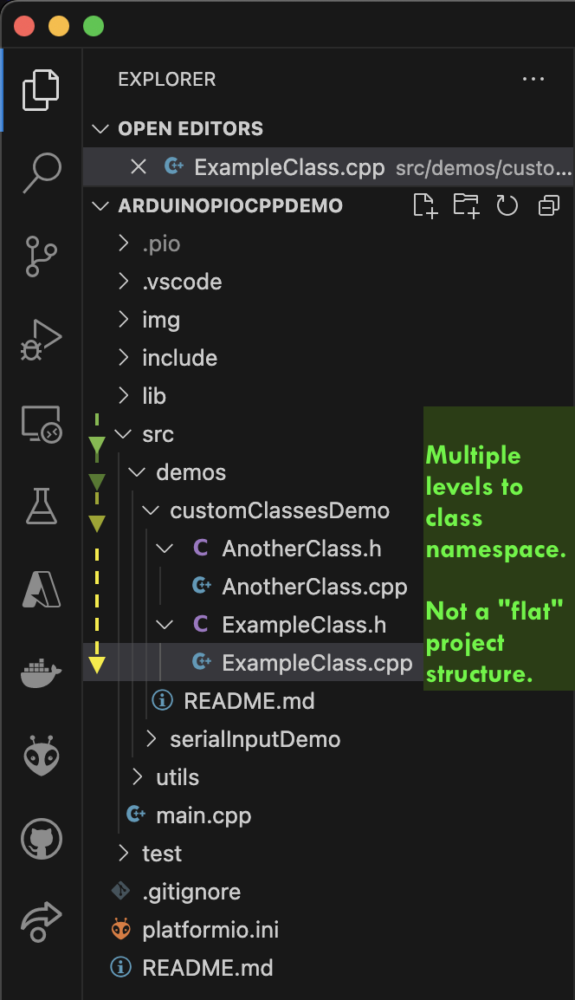

# Custom Classes Demo

This project demonstrates some simple file structures which are typical in object oriented programming projects. This project adapts some of those patterns to a PlatformIO project.

You should see a custom class, named `ExampleClass`, in a sub directory. The settings files included in this project should inform VSCode how to represent them in the _Explorer_ panel. They should be represented as `header` file with its backing `code` file nested underneath. See the example screen shot below...

> 
