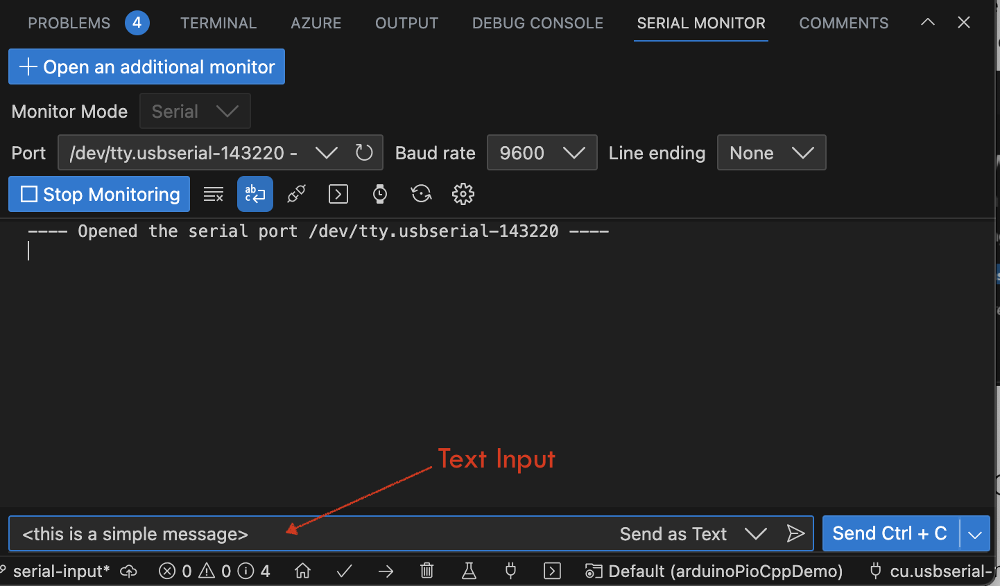
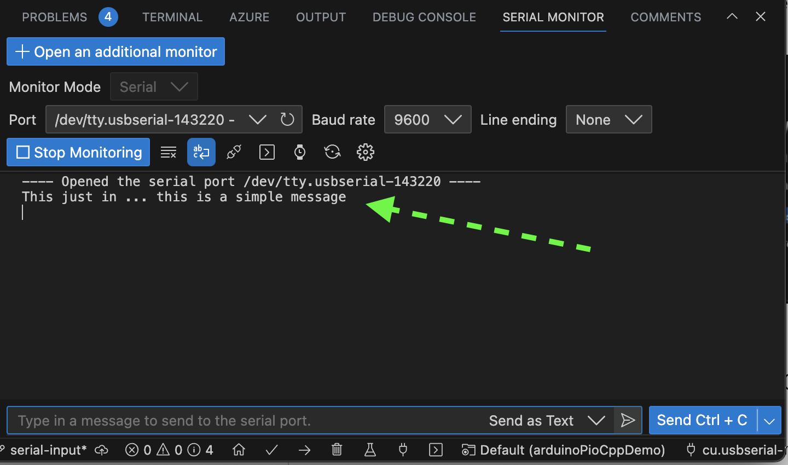

# Serial Input Demonstration

This class is simply used to demonstrate handling [Serial](https://www.arduino.cc/reference/en/language/functions/communication/serial/) input. In the case of this example, the input is generated by user input. In the real world, this could be a user or another device. When entering text for this code to parse and echo back, be sure to wrap your input message in `<` and `>`.  This code was originally published on the Arduino forum at [**this link**](https://forum.arduino.cc/t/serial-input-basics-updated/382007/2#example-3-a-more-complete-system-1).

For a full write up and explanation of the [`Serial`](https://www.arduino.cc/reference/en/language/functions/communication/serial/) concepts demonstrated here, please refer to the source article.  If you're using VSCode, it's easiest to test with the `Serial Monitor` Extension, by Microsoft:

|      |      |
| ----: | :---- |
| **Name** | Serial Monitor |
| **ID** | `ms-vscode.vscode-serial-monitor` |
| **Description** | Send and receive text from serial ports. Version: 0.10.0 |
| **Publisher** | Microsoft |
| **VS Marketplace Link** | [Link](https://marketplace.visualstudio.com/items?itemName=ms-vscode.vscode-serial-monitor) |

## Testing

To test this code:

 1. Before running this example, be sure to comment/uncomment the appropriate lines in the `main.cpp` file.
 1. Compile and deploy it to your device.
 1. Open the `Serial Monitor`
     1. Select the port appropriate for your local setup
 1. Type in a message
 1. Observe the message is echoed back to you

| Input | Response |
| ----- | -------- |
|  |  |
